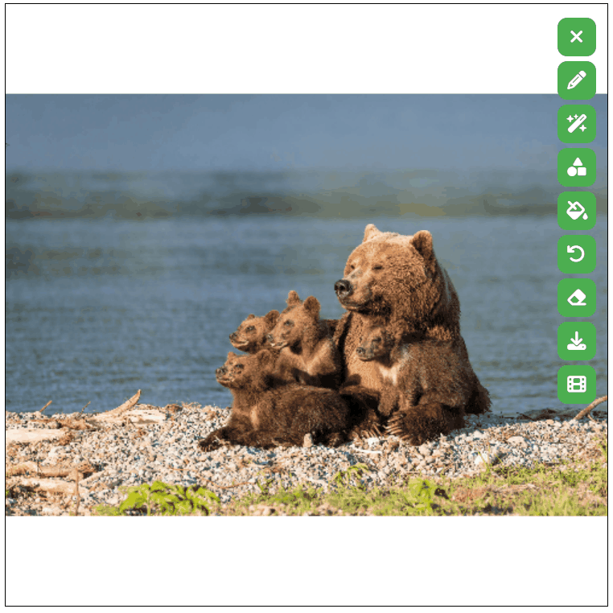
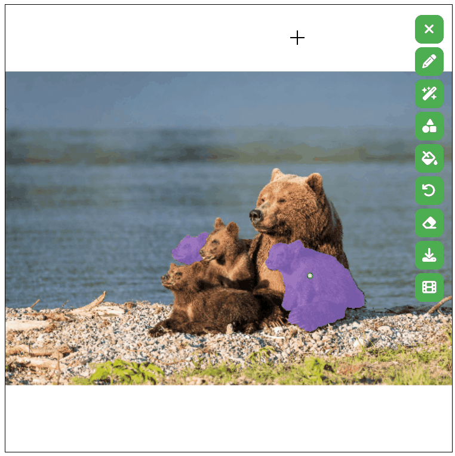
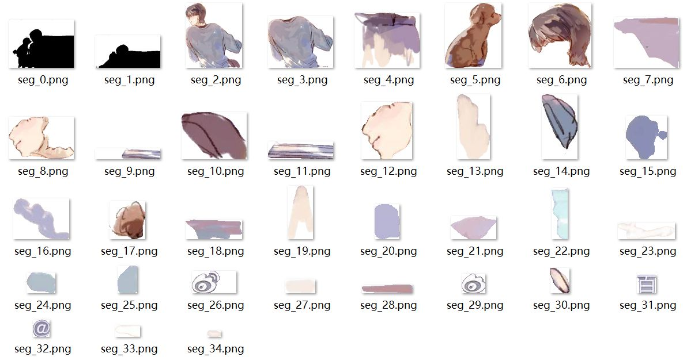
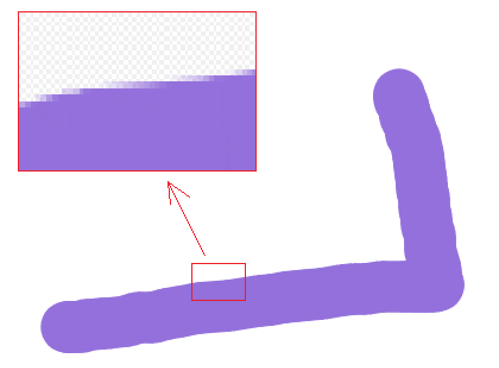

# SegDrawer
Simple static web-based mask drawer, supporting semantic drawing with Segment Anything Model ([SAM](https://github.com/facebookresearch/segment-anything)) and Video Segmentation Propagation with [XMem](https://github.com/hkchengrex/XMem).

<table>
  <tr>
    <td align="center">
      
    </td>
    <td align="center">
      
    </td>
    <td align="center">
      
    </td>
  </tr>
</table>

- Video Segmentation with [XMem](https://github.com/hkchengrex/XMem)

<table>
  <tr>
    <td align="center">
      <a href="https://www.youtube.com/watch?v=fn3KWM1kuAw">original video</a><br>
      
    </td>
    <td align="center">
      first frame<br>
      
    </td>
  </tr>
  <tr>
    <td align="center">
      segmentation<br>
      
    </td>
    <td align="center">
      VideoSeg<br>
      
    </td>
  </tr>
</table>

- Interactive segmentation
<table>
  <tr>
    <td align="center">
      Interactive segmentation<br>
      
    </td>
    <td align="center">
      Revert during interactive seg.<br>
      
    </td>
  </tr>
</table>

# Tools

From top to bottom
- Clear image
- Drawer
- SAM point-segmenter with interactive functionality(Need backend)
- SAM rect-segmenter (Need backend)
- SAM Seg-Everything (Need backend)
- Undo
- Eraser
- Download
- VideoSeg (Need backend)

After **Seg-Everything**, the downloaded files would include .zip file, which contains all cut-offs.

<table>
  <tr>
    <td align="center">
      
    </td>
    <td align="center">
      
    </td>
  </tr>
</table>

For **Video Segmentation**, according to [XMem](https://github.com/hkchengrex/XMem), an initial segmentation map is needed, which can be easily achieved with [SAM](https://github.com/facebookresearch/segment-anything). You can upload a video just as uploading an image, then draw a segmentation on it, after which you can click the final button of `VideoSeg` to upload it to the server and wait for the automatic download of video seg result.

Note: you may not want to draw the segmentation map manually with the tool `Drawer` (Same problem holds for `Eraser`), which leads to non-single color paints especially on the edge as shown below. This is not good for XMem video segmentation. For more details please refer to the original paper.

<table>
  <tr>
    <td align="center">
      
    </td>
  </tr>
</table>

For **Interactive Segmentation**

1. How to start
    - Click magic wand button (the curso becomes cross)
2. How to use
    - Postive prompt by single left click
    - Negative prompt by single right click
    - The behavior of revert button will change, which removes the latest interactive prompt
3. How to end
    - Click the magic wand button once again (the curso becomes normal)
    - The latest mask will save to the mask collections
    - The behavior of revert button will be turned back


# Run Locally

If don't need SAM for segmentation, just open segDrawer.html and use tools except SAM segmenter.

If use SAM segmenter, do following steps (CPU can be time-consuming)
- Download models as mentioned in [segment-anything](https://github.com/facebookresearch/segment-anything) and [XMem](https://github.com/hkchengrex/XMem).
For example
```
wget https://dl.fbaipublicfiles.com/segment_anything/sam_vit_l_0b3195.pth
wget -P ./XMem/saves/ https://github.com/hkchengrex/XMem/releases/download/v1.0/XMem.pth
```
- Launch backend
```
python server.py
```
- Go to Browser
```
http://127.0.0.1:8000
```

For configuring CPU/GPU and model, just change the code in server.py
```
sam_checkpoint = "sam_vit_l_0b3195.pth" # "sam_vit_l_0b3195.pth" or "sam_vit_h_4b8939.pth"
model_type = "vit_l" # "vit_l" or "vit_h"
device = "cuda" # "cuda" if torch.cuda.is_available() else "cpu"
```

# Run on Colab

Follow this [Colab example](SegDrawer.ipynb), or run on [Colab](https://colab.research.google.com/drive/1PdWCpBgYwiQtvkdTBnW-y2T-s_Fc-2iI?usp=sharing). Need to register an ngrok account and copy your token to replace "{your_token}".
