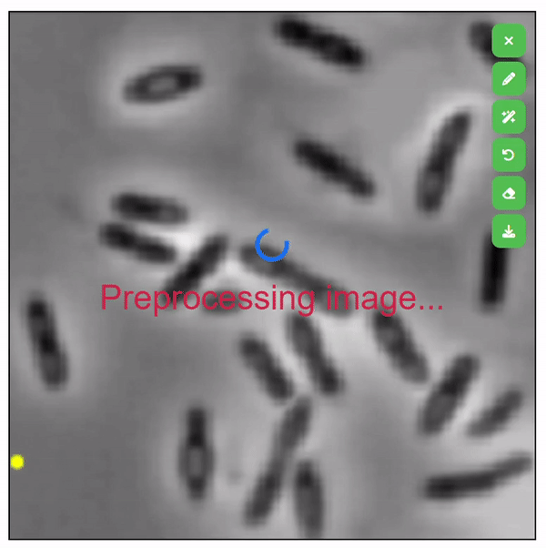

# SegDrawer
Simple static web-based mask drawer, supporting semantic drawing with Segment Anything Model (SAM).

<center>
  
</center>

# Tools

From top to bottom
- Clear image
- Drawer
- SAM segmenter (Need backend)
- Undo
- Eraser
- Download

# Run

If don't need SAM for segmentation, just open segDrawer.html and use tools except SAM segmenter.

If use SAM segmenter, do following steps
- Download models as mentioned in [segment-anything](https://github.com/facebookresearch/segment-anything).
For example
```
wget https://dl.fbaipublicfiles.com/segment_anything/sam_vit_l_0b3195.pth
```
- Launch backend
```
python server.py
```

For configuring GPU and model, just change the code in server.py
```
sam_checkpoint = "sam_vit_l_0b3195.pth" # "sam_vit_l_0b3195.pth" or "sam_vit_h_4b8939.pth"
model_type = "vit_l" # "vit_l" or "vit_h"
device = "cpu" # "cuda" if torch.cuda.is_available() else "cpu"
```
